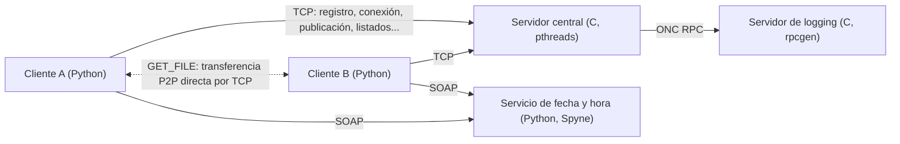

# Sistema distribuido de compartición de ficheros P2P

> Un sistema híbrido de compartición de ficheros entre pares: un servidor central concurrente en C lleva el registro de usuarios y ficheros publicados, mientras que los ficheros viajan directamente entre clientes. Lo completan dos servicios de middleware: un servidor de logging con ONC RPC y un servicio web SOAP de fecha y hora.
> Práctica de Sistemas Distribuidos · Grado en Ingeniería Informática · Universidad Carlos III de Madrid

**Idioma:** [English](./README.md) · Español

---

## Arquitectura



| Componente | Lenguaje | Función |
| :--- | :--- | :--- |
| Servidor central (`server.c`) | C | Guarda en memoria los usuarios, sus datos de conexión y sus ficheros publicados. Atiende cada petición en un hilo. |
| Cliente (`client.py`) | Python | Intérprete de comandos. Se comunica con el servidor y sirve sus propios ficheros a otros clientes desde un hilo en segundo plano. |
| Servidor de logging (`logger.x`, `rpc_server_changed/logger_server.c`) | C, ONC RPC | Recibe e imprime un registro por cada operación que atiende el servidor central. |
| Servicio de fecha y hora (`FechaHoraService.py`) | Python, SOAP | Proporciona la marca temporal que los clientes adjuntan a cada petición. |

**Cómo funciona una descarga.** El servidor nunca ve el contenido de los ficheros. Cuando un usuario ejecuta `GET_FILE`, el cliente pide al servidor la lista de usuarios conectados con su IP y su puerto, se conecta directamente al socket de escucha del propietario y descarga el fichero. La transferencia envía primero el tamaño y recibe el contenido por bloques; si falla, se borra el fichero local incompleto.

---

## Aspectos técnicos destacados

- **Servidor concurrente en C.** Sockets TCP con un `pthread` independiente (detached) por petición.
- **Exclusión mutua de grano fino.** Un mutex protege la lista de usuarios y cada usuario tiene otro para su lista de ficheros, así que las operaciones sobre ficheros de usuarios distintos no se bloquean entre sí. Las comprobaciones y modificaciones que deben ser atómicas (como comprobar que un nombre está libre y registrarlo) se hacen en una sola sección crítica, y los listados copian los datos que necesitan mientras tienen el bloqueo, así que no se hace E/S de red con un bloqueo tomado y ningún hilo conserva un puntero a un usuario que otro hilo pueda liberar.
- **Protocolo de aplicación propio sobre TCP.** Ocho operaciones con el servidor (`REGISTER`, `UNREGISTER`, `CONNECT`, `DISCONNECT`, `PUBLISH`, `DELETE`, `LIST_USERS`, `LIST_CONTENT`) y una entre clientes (`GET_FILE`). Los mensajes son cadenas terminadas en `\0` y cada respuesta empieza con un código de un byte que distingue el éxito de cada caso de error (usuario inexistente, no conectado, fichero ya publicado...).
- **E/S robusta.** `sendMessage` reintenta hasta escribir el buffer completo, y `readLine` lee byte a byte hasta el terminador, gestionando `EINTR`.
- **Dos tecnologías de middleware.** La interfaz de logging se define en `logger.x` y sus stubs se generan con `rpcgen`; el servicio de fecha y hora es un endpoint SOAP creado con Spyne y consumido con zeep.
- **Los clientes solo sirven ficheros publicados.** Un cliente atiende una descarga solo si el fichero está en su lista de ficheros publicados, que reconstruye a partir del servidor al volver a conectarse, así que otros usuarios no pueden pedir rutas arbitrarias.
- **Cierre ordenado.** El servidor captura `SIGINT`, cierra su socket y libera toda la memoria; el cliente se desconecta automáticamente con `QUIT`.

---

## Ejecución

**Requisitos:** Linux, `gcc`, `make`, `rpcgen`, `libtirpc-dev` y el servicio `rpcbind` en marcha; Python 3 con los paquetes de `requirements.txt` (`pip install -r requirements.txt`).

```bash
make                                    # genera los stubs RPC y compila los dos programas en C

./logger_rpc                            # 1. servidor de logging (requiere rpcbind)
python3 FechaHoraService.py             # 2. servicio de fecha y hora en http://127.0.0.1:8000
export LOG_RPC_IP=<IP del servidor de logging>
./servidor -p <puerto>                  # 3. servidor central
python3 client.py -s <IP del servidor> -p <puerto>   # 4. un cliente por usuario
```

Comandos del cliente:

```
REGISTER <usuario>       UNREGISTER <usuario>
CONNECT <usuario>        DISCONNECT <usuario>
PUBLISH <fichero> <descripción>
DELETE <fichero>
LIST_USERS               LIST_CONTENT <usuario>
GET_FILE <usuario> <fichero_remoto> <fichero_local>
QUIT
```

---

## Limitaciones conocidas

- **El estado vive en memoria.** Los usuarios y ficheros publicados se pierden al parar el servidor.
- **El servicio de fecha y hora solo escucha en `127.0.0.1`**, así que cada cliente debe ejecutarse en la misma máquina que una instancia del servicio.
- **Se abre una conexión RPC nueva por cada registro**, lo que es sencillo pero añade latencia a cada operación.
- **No hay autenticación.** Cualquier cliente puede actuar en nombre de cualquier usuario, y las transferencias no van cifradas.

---

## Pruebas

`tests/` contiene un conjunto de pruebas que se ejecuta sin los servicios RPC y SOAP: el servidor se compila con un sustituto del logger RPC y el cliente usa un módulo SOAP simulado.

- **Prueba funcional:** todas las operaciones del servidor y sus códigos de error, hablando el protocolo directamente por TCP.
- **Pruebas de estrés de concurrencia**, ejecutadas con AddressSanitizer y ThreadSanitizer: 200 rondas de 16 registros simultáneos del mismo nombre, y 6 hilos listando los ficheros de un usuario mientras otro hilo lo da de baja y lo vuelve a crear continuamente.
- **Prueba de extremo a extremo:** un servidor y dos clientes reales que publican, listan y descargan ficheros, incluidos intentos de descargar ficheros no publicados y rutas del sistema, y una reconexión en un proceso nuevo.

```bash
cd tests && bash run_tests.sh
```

Estas pruebas encontraron dos fallos de concurrencia en una versión anterior del servidor (un registro duplicado con peticiones simultáneas y un uso de memoria liberada en `LIST_CONTENT`, detectado por AddressSanitizer) y un problema de acceso a rutas arbitrarias en el cliente; los tres están corregidos.

---

## Estructura del repositorio

```
├── server.c                        # Servidor central
├── client.py                       # Cliente y servicio de ficheros entre pares
├── logger.x                        # Definición de la interfaz RPC
├── rpc_server_changed/
│   └── logger_server.c             # Implementación del servidor RPC de logging
├── FechaHoraService.py             # Servicio SOAP de fecha y hora
├── Makefile
├── tests/                          # Pruebas funcionales, de concurrencia y de extremo a extremo
├── requirements.txt
├── README.md
└── README.es.md
```

Los ficheros generados por `rpcgen` (`logger.h`, `logger_clnt.c`, `logger_svc.c`, `logger_xdr.c`) no se versionan: `make` los regenera a partir de `logger.x`.

---

## Autor

**Fernando Martín Arencibia** · [LinkedIn](https://www.linkedin.com/in/fernando-martin-arencibia-477257368/) · [GitHub](https://github.com/fernandomartinarencibia) · [Email](mailto:fernandomartinarencibia@gmail.com)
