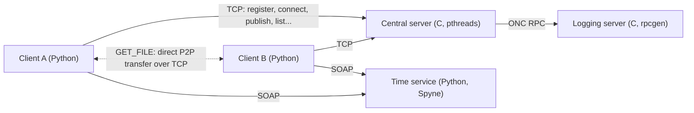

# Distributed P2P File Sharing System

> A hybrid peer-to-peer file sharing system: a concurrent central server in C keeps track of users and published files, while files travel directly between clients. Two middleware services complete it: an ONC RPC logging server and a SOAP time service.
> Distributed Systems coursework · BSc in Computer Science and Engineering · Universidad Carlos III de Madrid

**Language:** English · [Español](./README.es.md)

---

## Architecture



| Component | Language | Role |
| :--- | :--- | :--- |
| Central server (`server.c`) | C | Keeps users, their connection details and published files in memory. Serves one thread per request. |
| Client (`client.py`) | Python | Interactive shell. Talks to the server and serves its own files to other peers on a background thread. |
| Logging server (`logger.x`, `rpc_server_changed/logger_server.c`) | C, ONC RPC | Receives and prints a log entry for every operation handled by the central server. |
| Time service (`FechaHoraService.py`) | Python, SOAP | Provides the timestamp that clients attach to every request. |

**How a download works.** The server never sees file contents. When a user runs `GET_FILE`, the client asks the server for the list of connected users with their IP and port, then connects directly to the owner's listening socket and downloads the file. The transfer sends the file size first and receives the content in chunks; if it fails, the partial local file is deleted.

---

## Technical highlights

- **Concurrent server in C.** TCP sockets with one detached `pthread` per request.
- **Fine-grained locking.** One mutex protects the list of users and each user has a separate mutex for their file list, so operations on different users' files do not block each other. Checks and updates that must be atomic (such as checking that a name is free and registering it) run in a single critical section, and listings copy the data they need while holding the lock, so no network I/O happens with a lock held and no thread keeps a pointer to a user that another thread may free.
- **Custom application protocol over TCP.** Eight operations with the server (`REGISTER`, `UNREGISTER`, `CONNECT`, `DISCONNECT`, `PUBLISH`, `DELETE`, `LIST_USERS`, `LIST_CONTENT`) and one between peers (`GET_FILE`). Messages are null-terminated strings, and every reply starts with a one-byte result code that distinguishes success from each error case (user does not exist, not connected, file already published...).
- **Robust I/O.** `sendMessage` retries until the whole buffer is written, and `readLine` reads byte by byte up to the terminator, handling `EINTR`.
- **Two middleware technologies.** The logging interface is defined in `logger.x` and its stubs are generated with `rpcgen`; the time service is a SOAP endpoint built with Spyne and consumed with zeep.
- **Peers only serve published files.** A client serves a download only if the file is in its list of published files, which it rebuilds from the server when it reconnects, so other users cannot request arbitrary paths.
- **Clean shutdown.** The server handles `SIGINT`, closes its socket and frees all memory; the client disconnects automatically on `QUIT`.

---

## Running it

**Requirements:** Linux, `gcc`, `make`, `rpcgen`, `libtirpc-dev` and a running `rpcbind` service; Python 3 with the packages in `requirements.txt` (`pip install -r requirements.txt`).

```bash
make                                    # generates the RPC stubs and builds both C programs

./logger_rpc                            # 1. logging server (requires rpcbind)
python3 FechaHoraService.py             # 2. time service at http://127.0.0.1:8000
export LOG_RPC_IP=<logging server IP>
./servidor -p <port>                    # 3. central server
python3 client.py -s <server IP> -p <port>   # 4. one client per user
```

Client commands:

```
REGISTER <user>          UNREGISTER <user>
CONNECT <user>           DISCONNECT <user>
PUBLISH <file> <description>
DELETE <file>
LIST_USERS               LIST_CONTENT <user>
GET_FILE <user> <remote_file> <local_file>
QUIT
```

---

## Known limitations

- **State lives in memory.** Users and published files are lost when the server stops.
- **The time service only listens on `127.0.0.1`**, so each client must run on the same machine as an instance of the service.
- **A new RPC connection is opened for every log entry**, which is simple but adds latency to each operation.
- **No authentication.** Any client can act on behalf of any user name, and transfers are not encrypted.

---

## Testing

`tests/` contains a test suite that runs without the RPC and SOAP services: the server is compiled against a stub of the RPC logger, and the client uses a fake SOAP module.

- **Functional test:** every server operation and its error codes, speaking the protocol directly over TCP.
- **Concurrency stress tests**, run under AddressSanitizer and ThreadSanitizer: 200 rounds of 16 simultaneous registrations of the same name, and 6 threads listing a user's files while another thread repeatedly unregisters and re-creates that user.
- **End-to-end test:** a server and two real clients that publish, list and download files, including attempts to download unpublished files and system paths, and a reconnection in a new process.

```bash
cd tests && bash run_tests.sh
```

These tests found two concurrency bugs in an earlier version of the server (a duplicated registration under concurrent requests, and a use-after-free detected by AddressSanitizer in `LIST_CONTENT`) and a path traversal issue in the client; all three are fixed.

---

## Repository structure

```
├── server.c                        # Central server
├── client.py                       # Client and peer file service
├── logger.x                        # RPC interface definition
├── rpc_server_changed/
│   └── logger_server.c             # RPC logging server implementation
├── FechaHoraService.py             # SOAP time service
├── Makefile
├── tests/                          # Functional, concurrency and end-to-end tests
├── requirements.txt
├── README.md
└── README.es.md
```

The files generated by `rpcgen` (`logger.h`, `logger_clnt.c`, `logger_svc.c`, `logger_xdr.c`) are not versioned: `make` regenerates them from `logger.x`.

---

## Author

**Fernando Martín Arencibia** · [LinkedIn](https://www.linkedin.com/in/fernando-martin-arencibia-477257368/) · [GitHub](https://github.com/fernandomartinarencibia) · [Email](mailto:fernandomartinarencibia@gmail.com)
